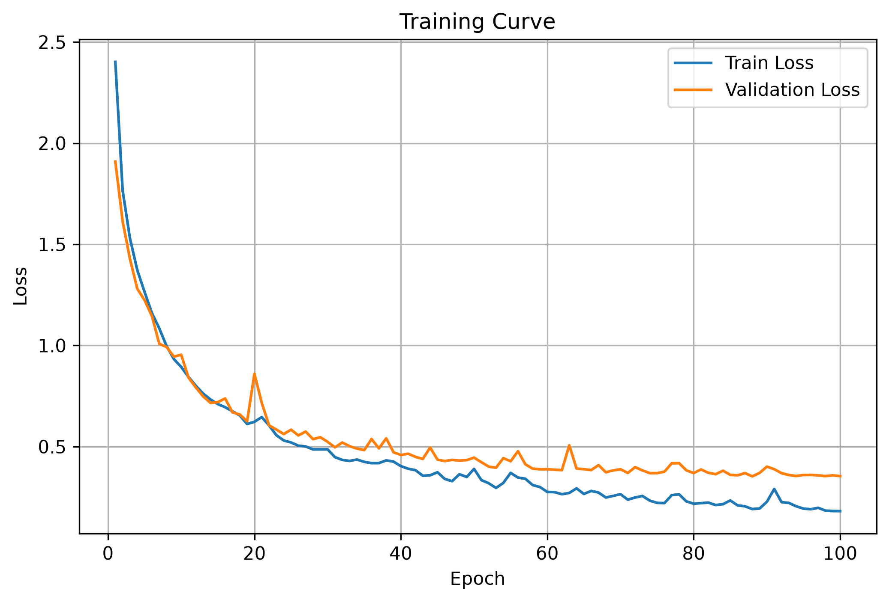
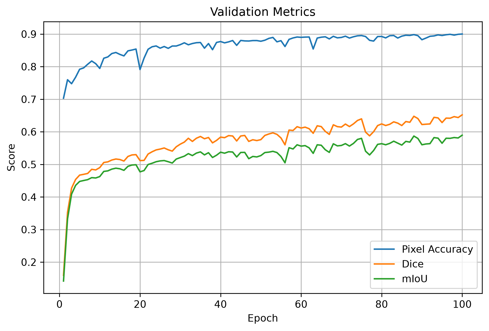

<div align="center">


# U-Net Semantic Segmentation

### Pixel-wise scene understanding using a custom U-Net implementation built from scratch in PyTorch.


</div>

---

## Overview

Semantic segmentation is a dense prediction task where every pixel in an image is assigned a semantic class. Unlike image classification or object detection, segmentation enables a model to understand the complete spatial layout of a scene.

This project implements the **original U-Net architecture from scratch** using **PyTorch** and trains it on the **CamVid** dataset for urban scene understanding. The entire pipeline—from data loading and augmentation to training, evaluation, inference, checkpointing, and visualization—was built from the ground up to better understand how modern semantic segmentation systems are engineered.

---

## Features

- Custom U-Net implementation from scratch
- Custom CamVid Dataset class
- Albumentations data augmentation pipeline
- PyTorch DataLoaders
- Complete training & validation pipeline
- Model checkpointing
- Evaluation script
- Inference pipeline
- Automatic metric computation
- Automatic training curve generation
- Pixel Accuracy
- Dice Score
- Mean Intersection over Union (mIoU)

---

# Project Structure

```text
.
├── assets/
│   └── github-header-banner.png
│
├── data/
│   └── CamVid/
│
├── models/
│   └── unet.py
│
├── results/
│   ├── loss_curve.png
│   ├── metrics_curve.png
│   └── metrics.txt
│
├── camvid_dataset.py
├── dataloader.py
├── transforms.py
├── metrics.py
├── plot_utils.py
├── utils.py
├── train.py
├── evaluate.py
├── infer.py
├── requirements.txt
└── README.md
```

---

# Model Architecture

The model follows the original **U-Net encoder-decoder architecture** proposed for semantic segmentation.

```
Input Image
      │
      ▼
┌─────────────────┐
│     Encoder     │
└─────────────────┘
      │
      ▼
 Skip Connections
      │
      ▼
┌─────────────────┐
│   Bottleneck    │
└─────────────────┘
      │
      ▼
┌─────────────────┐
│     Decoder     │
└─────────────────┘
      │
      ▼
Segmentation Mask
```

The encoder progressively extracts high-level semantic features, while the decoder restores spatial resolution. Skip connections preserve fine-grained localization information by combining encoder and decoder feature maps.

---

# Dataset

**CamVid (Cambridge-driving Labeled Video Database)** is a semantic segmentation dataset containing densely annotated road scene images captured from a driving perspective.

### Characteristics

- Urban driving scenes
- 32 semantic classes
- Pixel-level annotations
- RGB images
- Road, buildings, pedestrians, cars, trees, sky, signs, sidewalks, and more

---

# Training Pipeline

```
CamVid Dataset
        │
        ▼
Albumentations
        │
        ▼
DataLoader
        │
        ▼
U-Net
        │
        ▼
CrossEntropy Loss
        │
        ▼
Adam Optimizer
        │
        ▼
Validation Metrics
        │
        ▼
Checkpoint Saving
        │
        ▼
Training Curves
```

---

# Evaluation Metrics

The model is evaluated using multiple complementary metrics:

| Metric | Description |
|---------|-------------|
| **Validation Loss** | CrossEntropy Loss on validation data |
| **Pixel Accuracy** | Percentage of correctly classified pixels |
| **Dice Score** | Measures overlap between prediction and ground truth |
| **Mean IoU** | Mean Intersection over Union across all classes |

---

# Results

| Metric | Score |
|---------|------:|
| Validation Loss | **0.5413** |
| Pixel Accuracy | **86.11%** |
| Dice Score | **54.80%** |
| Mean IoU | **50.97%** |

> **Note:** These results correspond to the baseline U-Net trained on the CamVid dataset.

---

# Training Curves

### Loss Curve

<p align="center">

</p>

### Validation Metrics

<p align="center">

</p>

---

# Sample Predictions

> Example qualitative predictions will be added after final training.

```
Input Image

        ↓

Model Prediction

        ↓

Ground Truth Mask
```

---

# Installation

Clone the repository

```bash
git clone https://github.com/yourusername/unet-semantic-segmentation.git
cd unet-semantic-segmentation
```

Install dependencies

```bash
pip install -r requirements.txt
```

---

# Training

```bash
python train.py
```

Training automatically

- saves the best checkpoint
- computes validation metrics
- plots training curves

---

# Evaluation

```bash
python evaluate.py
```

This generates

- Validation Loss
- Pixel Accuracy
- Dice Score
- Mean IoU

along with a complete evaluation report.

---

# Inference

```bash
python infer.py
```

Runs inference on a sample image and visualizes

- Input Image
- Ground Truth
- Predicted Segmentation Mask

---

# What I Learned

This project helped me understand

- Encoder–decoder architectures
- Skip connections
- Semantic segmentation pipelines
- Pixel-wise classification
- Building custom PyTorch datasets
- Data augmentation using Albumentations
- Training and validation workflows
- Model checkpointing
- Quantitative evaluation using Dice and mIoU
- Building complete deep learning pipelines from scratch

---

# Future Improvements

- Attention U-Net
- U-Net++
- DeepLabV3+
- Mixed Precision Training
- Learning Rate Scheduling
- Early Stopping
- Hyperparameter Optimization
- TensorBoard / Weights & Biases Integration
- Multi-dataset benchmarking

---

# Acknowledgements

- **U-Net: Convolutional Networks for Biomedical Image Segmentation**
- **CamVid Dataset**
- **PyTorch**
- **Albumentations**

---

<div align="center">

If you found this project useful, consider giving it a ⭐.

</div>